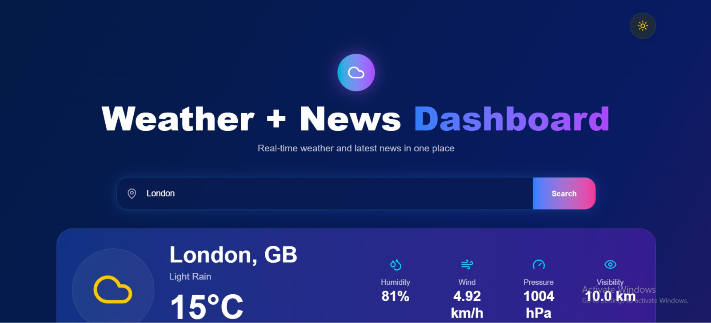
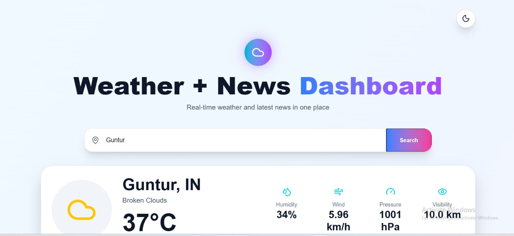
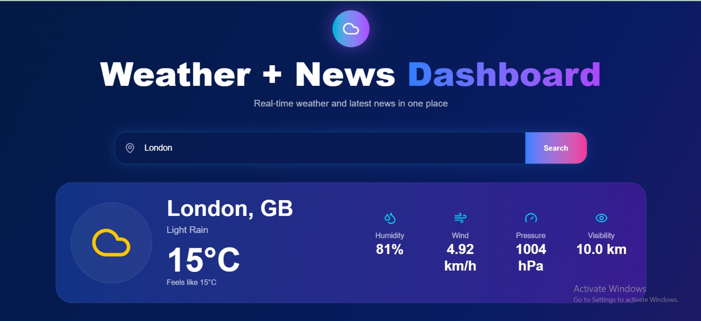

# 🌦️ Weather + News Dashboard

A modern React-based Single Page Application (SPA) that allows users to check real-time weather information and browse the latest news by category in one place.

---

## 📌 Project Overview

Users often switch between multiple apps to check weather updates and daily news. This dashboard solves that problem by combining both features into a single responsive application.

The application fetches:

- Real-time weather data from OpenWeatherMap API
- Latest news headlines from GNews API
- Supports category-based news filtering
- Dark / Light theme switching with persistence
- Shows skeleton loaders while data is loading
- built as a Single Page Application with a clean component architecture
---

## 🚀 Features

### 🌤️ Weather Module

- Search weather by city name
- Real-time weather information
- Temperature
- Weather condition
- Feels like temperature
- Humidity
- Wind Speed
- Pressure
- Visibility
- Country information

### 📰 News Module

- Latest headlines
- Category filtering
  - Technology
  - Business
  - Sports
  - Health
  - Entertainment
- Open full article in new tab

### 🎨 UI Features

- Dark Mode
- Light Mode
- Theme preference saved using LocalStorage
- Modern glassmorphism-inspired UI
- Responsive design

### ⚡ Performance Features

- Weather Skeleton Loader
- News Skeleton Loader
- Error handling
- Invalid city handling
- API failure handling
- Empty state handling

---

## 🛠️ Tech Stack

### Frontend

- React.js
- Vite
- Tailwind CSS

### APIs

- OpenWeatherMap API
- GNews API

### Libraries

- Axios
- Lucide React Icons

---

## 📂 Project Structure

```text
src/
│
├── assets/
│
├── components/
│   ├── ThemeToggle.jsx
│   ├── WeatherCard.jsx
│   ├── NewsCard.jsx
│   ├── NewsSection.jsx
│   ├── WeatherSkeleton.jsx
│   └── NewsSkeleton.jsx
│
├── pages/
│   └── Dashboard.jsx
│
├── services/
│   ├── weatherService.js
│   └── newsService.js
│
├── App.jsx
├── main.jsx
└── index.css
```

---

## ⚙️ Installation & Setup

### Clone Repository

```bash
git clone https://github.com/Abzal31640/azentrix-fullstack-task2
```

### Navigate to Project

```bash
cd azentrix-fullstack-task2
```

### Install Dependencies

```bash
npm install
```

### Create Environment Variables

Create a `.env` file in the root directory:

```env
VITE_WEATHER_KEY=YOUR_OPENWEATHER_API_KEY
VITE_GNEWS_KEY=YOUR_GNEWS_API_KEY
```

### Run Development Server

```bash
npm run dev
```

Application will start at:

```text
http://localhost:5173
```

---
## 📷 Screenshots

### 🌙 Dark Mode



---

### ☀️ Light Mode



---

### 🌦️ Weather Search



---

### 📰 News Section


---

### 🔥 Top News


---

## 🔐 Environment Variables

| Variable | Description |
|-----------|------------|
| VITE_WEATHER_KEY | OpenWeatherMap API Key |
| VITE_GNEWS_KEY | GNews API Key |

---

## ❌ Error Handling

The application gracefully handles:

- Invalid city names
- Empty search input
- Weather API failures
- News API failures
- No news available
- Network connectivity issues

---


## 🎥 Demo Video

Loom Video:

https://go.screenpal.com/watch/cO1h1Pnu2x5

---


## 👨‍💻 Author

**NEEHA Abzal**

- GitHub Username: Abzal31640
- GitHub: https://github.com/Abzal31640
- Repository: https://github.com/Abzal31640/azentrix-fullstack-task2

